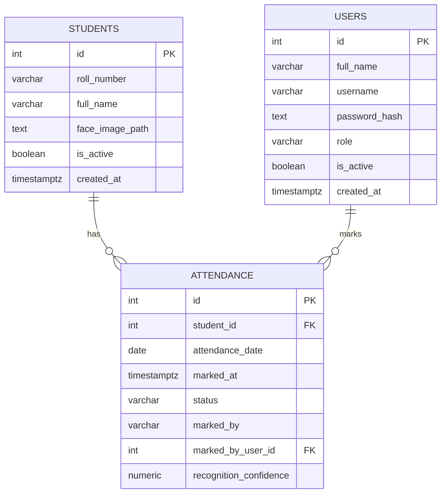
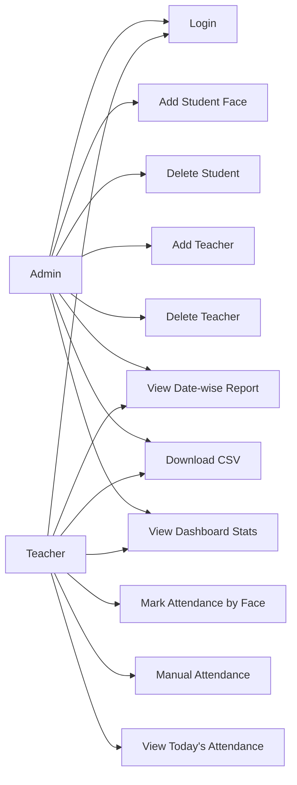
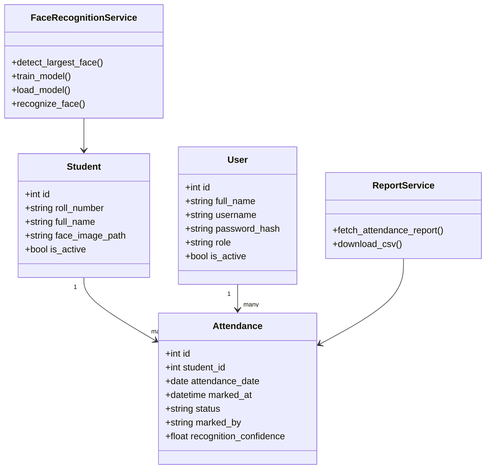
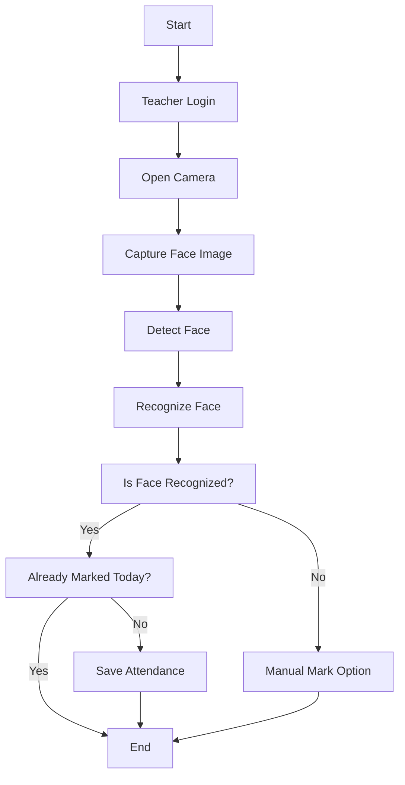
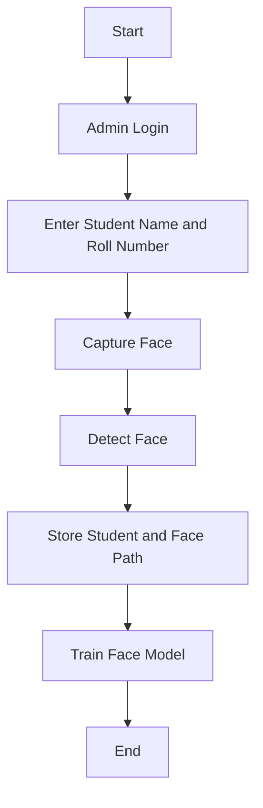
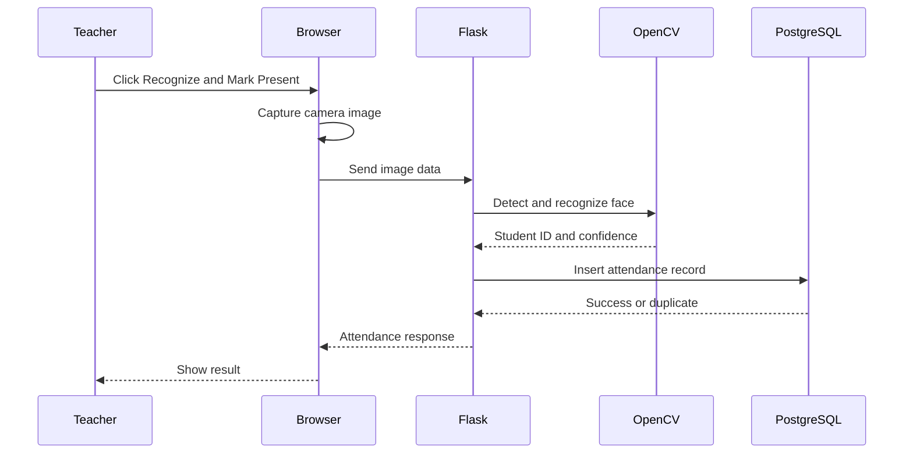
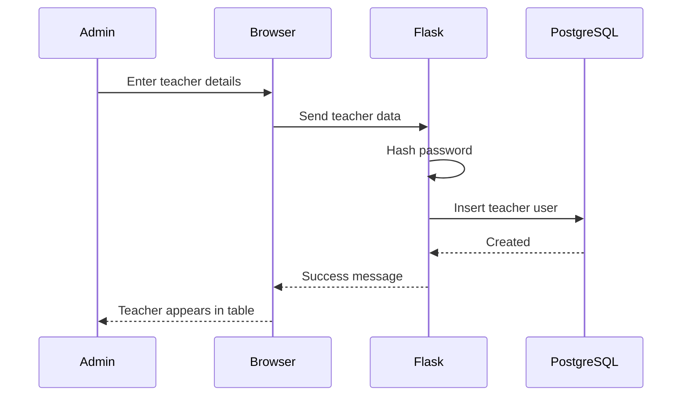

# Face Recognition Attendance System

## Project Report

**Project Title:** Face Recognition Attendance System  
**Technology Used:** HTML, CSS, JavaScript, Python Flask, OpenCV, PostgreSQL  
**Project Type:** College Academic Project  
**Prepared By:** Student  
**Academic Year:** 2025-2026  

---

## Table of Contents

| Sr. No. | Content | Page No. |
|---:|---|---|
| 1 | INTRODUCTION | 5 - 13 |
| 2 | PROPOSED SYSTEM | 14 - 19 |
| 3 | ANALYSIS & DESIGN | 20 - 38 |
| 4 | INPUT SCREENS WITH DATA | 39 - 45 |
| 5 | OUTPUT SCREENS WITH DATA | 46 - 51 |
| 6 | CODE SNIPPETS | 52 - 59 |
| 7 | TESTING (TEST CASES) | 60 - 64 |
| 8 | LIMITATIONS OF PROPOSED SYSTEM | 65 - 66 |
| 9 | PROPOSED ENHANCEMENT | 67 - 68 |
| 10 | CONCLUSION | 69 |
| 11 | BIBLIOGRAPHY | 70 |

---

# 1. INTRODUCTION

Attendance management is an important activity in schools, colleges, universities, coaching institutes, and organizations. Traditionally, attendance is recorded manually by calling student names or by using paper registers. This method is simple, but it consumes time, requires manual effort, and may lead to mistakes. In many situations, teachers have limited class time, and spending several minutes only for attendance reduces teaching time.

The **Face Recognition Attendance System** is designed to automate attendance marking by using a camera and face recognition technology. The system allows an administrator to register students by capturing their face images. Teachers can then mark attendance by using face recognition. If face recognition fails because of lighting, camera angle, or other issues, the teacher can manually mark attendance. This makes the system practical for real classroom use.

The system also includes role-based login. Admin users can manage students and teachers, while teacher users can mark attendance and view reports. Attendance records are stored in a PostgreSQL database and can be viewed date-wise. The system also supports CSV report download, which is useful for record keeping and academic submission.

This project uses commonly available technologies: HTML, CSS, JavaScript for the frontend, Python Flask for the backend, OpenCV for face recognition, and PostgreSQL for data storage.

## 1.1 Company Profile

This project is developed as an academic college project. It is not created for a specific company but is designed as a model system that can be used by educational institutions. If implemented in a real college, the system can be used by the administration department, teachers, and academic coordinators.

An educational institution usually manages large numbers of students. Manual attendance becomes difficult when student strength is high. This project proposes a digital solution that can reduce manual work and improve attendance record accuracy.

### Institution-Oriented Profile

An academic institution has the following general responsibilities:

- Managing student admission and student records.
- Assigning teachers to classes and subjects.
- Maintaining daily attendance.
- Preparing attendance reports for academic monitoring.
- Reducing proxy attendance and human error.
- Maintaining secure records for future reference.

The proposed system supports these responsibilities by providing a simple web-based platform where students, teachers, attendance data, and reports can be managed.

## 1.2 Abstract

The Face Recognition Attendance System is a web-based application that automates student attendance using face recognition. The system provides separate login panels for admin and teacher users. The admin can add student details with face data, create teacher accounts, delete students, and delete teacher accounts. The teacher can mark attendance using face recognition or manually mark attendance if the system fails to recognize a face.

The frontend is developed using HTML, CSS, and JavaScript. JavaScript accesses the camera using the browser media API and sends the captured image to the backend. The backend is built using Python Flask. OpenCV is used for face detection and recognition. PostgreSQL is used to store student records, teacher accounts, attendance details, and reporting data.

The system includes dashboard statistics such as total students, present today, absent today, and total teachers. It also includes date-wise attendance reports and CSV export. The project improves attendance management by reducing time, minimizing manual errors, and providing organized digital records.

## 1.3 Existing System

In many institutions, attendance is still recorded manually. The teacher calls out roll numbers or names, and students respond. The teacher then marks attendance in a register or spreadsheet. Although this method is widely used, it has many disadvantages.

### Problems in Existing System

- Manual attendance takes more time.
- Paper records can be lost or damaged.
- Teachers may make mistakes while marking attendance.
- Proxy attendance can happen when one student responds for another.
- Preparing monthly reports manually is time-consuming.
- Searching old attendance records is difficult.
- There is no automatic dashboard for present and absent counts.
- There is no direct CSV export for reporting.

### Existing Manual Workflow

1. Teacher enters classroom.
2. Teacher opens attendance register.
3. Teacher calls each student name or roll number.
4. Student responds.
5. Teacher marks present or absent.
6. Attendance data is manually counted later.
7. Reports are prepared manually.

This process may work for small classes, but it becomes inefficient as the number of students increases.

## 1.4 Scope of System

The proposed system covers the main attendance-related activities required for a college project and a small classroom environment.

### Included Scope

- Admin login.
- Teacher login.
- Student registration with face image.
- Teacher account creation by admin.
- Teacher account deletion by admin.
- Student deletion by admin.
- Face-based attendance marking.
- Manual attendance marking by teacher.
- Date-wise attendance report.
- CSV attendance report download.
- Dashboard summary cards.
- PostgreSQL database storage.

### Not Included in Current Scope

- Multi-class and subject-wise attendance.
- Parent/student login.
- SMS or email notification.
- Cloud deployment.
- Mobile application.
- Advanced deep learning face recognition.
- Biometric anti-spoofing.

The current scope is suitable for a college-level project and can be enhanced later.

## 1.5 Operating Environment - Hardware and Software

### Hardware Requirements

| Component | Minimum Requirement | Recommended Requirement |
|---|---|---|
| Processor | Intel i3 or equivalent | Intel i5 or above |
| RAM | 4 GB | 8 GB or above |
| Storage | 1 GB free space | 5 GB free space |
| Camera | Laptop webcam | HD webcam |
| Display | 1366 x 768 | 1920 x 1080 |
| Internet | Required for installation | Required for updates |

### Software Requirements

| Software | Purpose |
|---|---|
| Windows OS | Development and testing platform |
| Python | Backend programming language |
| VS Code | Code editor |
| PostgreSQL | Database management system |
| Browser | Running frontend and camera |
| Flask | Web application framework |
| OpenCV | Face detection and recognition |

## 1.6 Technology Used

### HTML

HTML is used to design the structure of web pages such as login page, admin panel, teacher panel, forms, tables, and buttons.

### CSS

CSS is used for styling the project. It controls colors, layout, cards, buttons, tables, spacing, and responsive design.

### JavaScript

JavaScript is used for browser-side logic. It starts the camera, captures images, sends data to Flask APIs, refreshes tables, downloads reports, and updates dashboard cards.

### Python

Python is used for backend logic. It handles routes, database operations, face recognition, login sessions, and report generation.

### Flask

Flask is a Python web framework used to create backend routes and serve HTML pages.

### OpenCV

OpenCV is used for face detection and face recognition. The project uses Haar Cascade for face detection and LBPH Face Recognizer for recognition.

### PostgreSQL

PostgreSQL is used to store students, users, teachers, and attendance records.

---

# 2. PROPOSED SYSTEM

The proposed system is a web-based Face Recognition Attendance System. It automates attendance marking by using a camera and face recognition. It also provides a manual attendance option for teachers. Admin and teacher roles are separated so that each user sees only the functions required for their work.

## 2.1 Feasibility Study

A feasibility study checks whether the proposed system can be developed and used successfully.

### Technical Feasibility

The system is technically feasible because it uses available open-source technologies. Python, Flask, OpenCV, PostgreSQL, HTML, CSS, and JavaScript are widely supported. The system can run on a normal laptop with a webcam.

### Operational Feasibility

The system is operationally feasible because it is simple to use. Admin can manage records through forms and tables. Teachers can mark attendance using a camera button or manual button. The interface is designed to be understandable for non-technical users.

### Economic Feasibility

The system is economically feasible because all major technologies used are free and open-source. No paid API or external hardware is required except a webcam, which is already available in most laptops.

### Schedule Feasibility

The project can be developed within an academic project timeline because it uses a simple modular design. The major modules are login, admin panel, teacher panel, attendance, reports, and database.

### Legal Feasibility

The system stores face images and attendance records, so it should be used with proper student consent. In an academic project, it is suitable for demonstration. In real deployment, privacy rules and institutional policies should be followed.

## 2.2 Objective of Proposed System

The main objective is to create a digital attendance system that reduces manual effort and improves attendance management.

### Main Objectives

- To automate student attendance using face recognition.
- To provide secure admin and teacher login.
- To allow admin to manage students and teachers.
- To allow teachers to mark attendance using face recognition.
- To allow manual attendance if recognition fails.
- To generate date-wise attendance reports.
- To export attendance reports in CSV format.
- To reduce paper-based attendance work.
- To improve accuracy and speed of attendance marking.

### Functional Objectives

- Register student with name, roll number, and face image.
- Store student data in PostgreSQL.
- Create teacher accounts.
- Authenticate users with username and password.
- Capture image from browser camera.
- Recognize face using OpenCV.
- Mark attendance once per student per day.
- Show present and absent statistics.
- Generate reports for selected dates.

### Non-Functional Objectives

- The system should be easy to use.
- The system should be responsive on desktop and mobile screens.
- The system should store data securely.
- The system should be maintainable.
- The system should work on common browsers.

---

# 3. ANALYSIS & DESIGN

Analysis and design define the system requirements, database structure, diagrams, and workflow. This section explains how the Face Recognition Attendance System is planned and organized.

## 3.1 Software Requirement Specification (SRS)

### Purpose

The purpose of this system is to provide a web-based attendance management solution using face recognition and manual teacher control.

### Users of System

| User | Description |
|---|---|
| Admin | Manages students, teachers, and system records |
| Teacher | Marks attendance and views reports |

### Functional Requirements

| Requirement ID | Requirement |
|---|---|
| FR-01 | Admin should be able to login |
| FR-02 | Teacher should be able to login |
| FR-03 | Admin should be able to add student with face image |
| FR-04 | Admin should be able to delete student |
| FR-05 | Admin should be able to add teacher |
| FR-06 | Admin should be able to delete teacher account |
| FR-07 | Teacher should be able to mark attendance by face |
| FR-08 | Teacher should be able to manually mark attendance |
| FR-09 | System should prevent duplicate attendance for same student on same date |
| FR-10 | System should show today's attendance |
| FR-11 | System should generate date-wise report |
| FR-12 | System should export CSV report |
| FR-13 | System should show dashboard statistics |

### Non-Functional Requirements

| Requirement ID | Requirement |
|---|---|
| NFR-01 | System should be user-friendly |
| NFR-02 | System should respond quickly for normal class size |
| NFR-03 | System should store data in relational database |
| NFR-04 | System should protect role-based functions |
| NFR-05 | System should be maintainable and modular |

### Assumptions

- Users have a webcam.
- Python and PostgreSQL are installed.
- Browser permission is granted for camera access.
- Students face the camera in proper lighting.

### Constraints

- Recognition accuracy depends on lighting and camera quality.
- The system is designed for demonstration/local use.
- The system currently supports one attendance session per day.

## 3.2 ERD

### Entity Relationship Description

The system has three main entities:

- `students`
- `users`
- `attendance`

One student can have many attendance records. One teacher user can mark many attendance records. Admin and teacher accounts are stored in the same `users` table with role separation.

### ERD in Mermaid Format



## 3.3 Table Structure

### Table: students

| Field Name | Data Type | Constraint | Description |
|---|---|---|---|
| id | SERIAL | Primary Key | Unique student ID |
| roll_number | VARCHAR(50) | Unique, Not Null | Student roll number |
| full_name | VARCHAR(120) | Not Null | Student full name |
| face_image_path | TEXT | Nullable | Stored face image path |
| is_active | BOOLEAN | Default TRUE | Student active status |
| created_at | TIMESTAMPTZ | Default NOW | Record creation date/time |

### Table: users

| Field Name | Data Type | Constraint | Description |
|---|---|---|---|
| id | SERIAL | Primary Key | Unique user ID |
| full_name | VARCHAR(120) | Not Null | User full name |
| username | VARCHAR(80) | Unique, Not Null | Login username |
| password_hash | TEXT | Not Null | Hashed password |
| role | VARCHAR(20) | admin/teacher | User role |
| is_active | BOOLEAN | Default TRUE | Account active status |
| created_at | TIMESTAMPTZ | Default NOW | Account creation date/time |

### Table: attendance

| Field Name | Data Type | Constraint | Description |
|---|---|---|---|
| id | SERIAL | Primary Key | Unique attendance ID |
| student_id | INTEGER | Foreign Key | Linked student |
| attendance_date | DATE | Default current date | Attendance date |
| marked_at | TIMESTAMPTZ | Default NOW | Attendance marking time |
| status | VARCHAR(20) | Default present | Attendance status |
| marked_by | VARCHAR(30) | Default face_recognition | Marking method |
| marked_by_user_id | INTEGER | Foreign Key | Teacher who marked |
| recognition_confidence | NUMERIC | Nullable | Face recognition score |

### Important Constraints

- `roll_number` is unique.
- `username` is unique.
- A student can have only one attendance record per date.
- Attendance is linked to student using foreign key.
- Manual/face attendance can be linked to teacher account.

## 3.4 Use Case Diagram

### Actors

- Admin
- Teacher

### Use Cases

Admin:

- Login
- Add student face
- Delete student
- Add teacher
- Delete teacher
- View dashboard
- View report
- Download CSV

Teacher:

- Login
- Mark face attendance
- Mark manual attendance
- View today's attendance
- View report
- Download CSV

### Use Case Diagram in Mermaid Format



## 3.5 Class Diagram

Although this project is implemented mainly through Flask route functions, the system can be represented using logical classes.



## 3.6 Activity Diagram

### Face Attendance Activity



### Admin Student Registration Activity



## 3.7 Sequence Diagram

### Teacher Face Attendance Sequence



### Admin Add Teacher Sequence



---

# 4. INPUT SCREENS WITH DATA

This section describes the main input screens of the system. Actual screenshots can be pasted in this section when preparing the final Word/PDF file.

## 4.1 Login Screen

### Purpose

The login screen is used by both admin and teacher users to access the system.

### Input Fields

| Field | Example Data | Validation |
|---|---|---|
| Username | admin | Required |
| Password | admin123 | Required |

### Sample Input

| Username | Password |
|---|---|
| admin | admin123 |

### Expected Result

If the username and password are valid, the user is redirected to the correct panel:

- Admin goes to Admin Panel.
- Teacher goes to Teacher Panel.

## 4.2 Admin Add Student Screen

### Purpose

Admin uses this screen to register a student with face data.

### Input Fields

| Field | Example Data | Validation |
|---|---|---|
| Full Name | Sarthak Bhujbal | Required |
| Roll Number | ADT23MGTB0415 | Required and unique |
| Face Image | Captured from camera | Face must be detected |

### Sample Input

| Full Name | Roll Number |
|---|---|
| Sarthak Bhujbal | ADT23MGTB0415 |

### Expected Result

Student data is stored in database and face model is trained.

## 4.3 Admin Add Teacher Screen

### Purpose

Admin can create a teacher account.

### Input Fields

| Field | Example Data | Validation |
|---|---|---|
| Teacher Name | Asha Bhujbal | Required |
| Username | asha | Required and unique |
| Password | teacher123 | Minimum 6 characters |

### Expected Result

Teacher account is created and appears in teacher list.

## 4.4 Teacher Face Attendance Screen

### Purpose

Teacher uses this screen to mark attendance by face recognition.

### Input

| Input | Source |
|---|---|
| Face image | Webcam |

### Expected Result

If face is recognized, attendance is marked present.

## 4.5 Teacher Manual Attendance Screen

### Purpose

Teacher uses this screen when face recognition fails.

### Input

Teacher clicks **Mark Present** button for the selected student.

### Expected Result

Attendance is marked as present with `teacher_manual` method.

## 4.6 Report Date Input Screen

### Purpose

Admin and teacher can select a date and view attendance report.

### Input Field

| Field | Example Data |
|---|---|
| Report Date | 2026-04-22 |

### Expected Result

System displays present and absent records for selected date.

---

# 5. OUTPUT SCREENS WITH DATA

## 5.1 Dashboard Output

Dashboard cards display summary information.

### Admin Dashboard Output

| Card | Example Value |
|---|---:|
| Total Students | 1 |
| Present Today | 1 |
| Absent Today | 0 |
| Total Teachers | 1 |

### Teacher Dashboard Output

| Card | Example Value |
|---|---:|
| Total Students | 1 |
| Present Today | 1 |
| Absent Today | 0 |

## 5.2 Today’s Attendance Output

| Name | Roll No. | Time | Marked By | Confidence |
|---|---|---|---|---:|
| Sarthak Bhujbal | ADT23MGTB0415 | 12:19 AM | Face Recognition | 31.424 |

## 5.3 Manual Attendance Output

When teacher manually marks attendance, output message:

```text
Teacher marked attendance for Sarthak Bhujbal.
```

## 5.4 Duplicate Attendance Output

If attendance is already marked:

```text
Sarthak Bhujbal is already marked present today.
```

## 5.5 Date-wise Report Output

| Name | Roll No. | Status | Time | Marked By |
|---|---|---|---|---|
| Sarthak Bhujbal | ADT23MGTB0415 | present | 12:19 AM | Face Recognition |

## 5.6 CSV Report Output

CSV file contains columns:

```text
Date, Roll Number, Student Name, Status, Marked Time, Marked By, Confidence
```

Example row:

```text
2026-04-22, ADT23MGTB0415, Sarthak Bhujbal, Present, 12:19 AM, Face Recognition, 31.424
```

---

# 6. CODE SNIPPETS

This section contains important code snippets from the project.

## 6.1 Flask Application Setup

```python
app = Flask(__name__)
app.secret_key = os.getenv("SECRET_KEY", "change-this-secret-key-for-college-project")
face_cascade = cv2.CascadeClassifier(CASCADE_PATH)
```

This code creates the Flask application, sets a secret key for login sessions, and loads the OpenCV Haar Cascade model.

## 6.2 Database Connection

```python
def get_db_connection():
    return psycopg2.connect(
        host=os.getenv("DB_HOST", "localhost"),
        port=os.getenv("DB_PORT", "5432"),
        dbname=os.getenv("DB_NAME", "attendance_system"),
        user=os.getenv("DB_USER", "postgres"),
        password=os.getenv("DB_PASSWORD", ""),
    )
```

This function connects Python Flask with PostgreSQL using environment variables.

## 6.3 Login Validation

```python
if user is None or not check_password_hash(user["password_hash"], password):
    return jsonify({"success": False, "message": "Invalid username or password."}), 401
```

This code checks whether the entered password matches the stored password hash.

## 6.4 Face Detection

```python
def detect_largest_face(image):
    gray = cv2.cvtColor(image, cv2.COLOR_BGR2GRAY)
    faces = face_cascade.detectMultiScale(
        gray,
        scaleFactor=1.2,
        minNeighbors=5,
        minSize=(80, 80),
    )

    if len(faces) == 0:
        return None

    x, y, w, h = max(faces, key=lambda box: box[2] * box[3])
    face = gray[y : y + h, x : x + w]
    return cv2.resize(face, FACE_SIZE)
```

This function converts the image to grayscale, detects faces, selects the largest face, and resizes it.

## 6.5 Face Recognition Model Training

```python
recognizer = create_recognizer()
recognizer.train(faces, np.array(labels))
recognizer.save(str(MODEL_PATH))
```

This code trains the LBPH face recognition model and saves it to a file.

## 6.6 Mark Attendance by Face

```python
student_id, confidence = recognizer.predict(face)
threshold = float(os.getenv("FACE_CONFIDENCE_THRESHOLD", "80"))

if confidence > threshold:
    return jsonify({
        "success": False,
        "message": "Face not recognized. Try better lighting or register again.",
        "confidence": round(float(confidence), 2),
    }), 404
```

This code predicts the student ID and checks confidence threshold.

## 6.7 Prevent Duplicate Attendance

```sql
UNIQUE (student_id, attendance_date)
```

This database constraint prevents the same student from being marked multiple times on the same date.

## 6.8 Manual Attendance Insert

```python
INSERT INTO attendance (student_id, marked_by, marked_by_user_id)
VALUES (%s, %s, %s)
ON CONFLICT (student_id, attendance_date) DO NOTHING
RETURNING id
```

This query marks attendance manually and avoids duplicate records.

## 6.9 JavaScript Camera Access

```javascript
const stream = await navigator.mediaDevices.getUserMedia({
    video: { width: 640, height: 480 },
    audio: false,
});
video.srcObject = stream;
```

This code starts the browser camera.

## 6.10 JavaScript Image Capture

```javascript
canvas.width = video.videoWidth;
canvas.height = video.videoHeight;
const context = canvas.getContext("2d");
context.drawImage(video, 0, 0, canvas.width, canvas.height);
return canvas.toDataURL("image/jpeg", 0.9);
```

This code captures the current camera frame as an image.

## 6.11 Attendance Report Query

```sql
SELECT
    s.full_name,
    s.roll_number,
    CASE WHEN a.id IS NULL THEN 'absent' ELSE a.status END AS status
FROM students s
LEFT JOIN attendance a
    ON a.student_id = s.id
    AND a.attendance_date = %s
WHERE s.is_active = TRUE
ORDER BY s.roll_number, s.full_name;
```

This query returns both present and absent students for the selected date.

## 6.12 CSV Report Generation

```python
writer.writerow(["Date", "Roll Number", "Student Name", "Status", "Marked Time", "Marked By", "Confidence"])
```

This code writes the CSV report header.

---

# 7. TESTING (TEST CASES)

Testing is performed to confirm that the system works as expected.

## 7.1 Login Test Cases

| Test ID | Test Case | Input | Expected Result | Status |
|---|---|---|---|---|
| TC-01 | Admin valid login | admin/admin123 | Redirect to admin panel | Pass |
| TC-02 | Invalid login | wrong/wrong | Show invalid message | Pass |
| TC-03 | Teacher valid login | teacher username/password | Redirect to teacher panel | Pass |
| TC-04 | Empty login | blank fields | Show validation message | Pass |

## 7.2 Admin Test Cases

| Test ID | Test Case | Input | Expected Result | Status |
|---|---|---|---|---|
| TC-05 | Add student | Name, roll no, face | Student added | Pass |
| TC-06 | Add duplicate roll number | Existing roll no | Duplicate message | Pass |
| TC-07 | Add teacher | Name, username, password | Teacher created | Pass |
| TC-08 | Add duplicate teacher username | Existing username | Error message | Pass |
| TC-09 | Delete student | Click delete | Student removed | Pass |
| TC-10 | Delete teacher | Click delete | Teacher deactivated | Pass |

## 7.3 Teacher Attendance Test Cases

| Test ID | Test Case | Input | Expected Result | Status |
|---|---|---|---|---|
| TC-11 | Face attendance recognized | Registered face | Attendance marked | Pass |
| TC-12 | Face attendance not recognized | Unknown face | Error message | Pass |
| TC-13 | Duplicate attendance | Same student same date | Already marked message | Pass |
| TC-14 | Manual attendance | Click Mark Present | Attendance marked | Pass |
| TC-15 | Manual duplicate | Already present student | Already marked message | Pass |

## 7.4 Report Test Cases

| Test ID | Test Case | Input | Expected Result | Status |
|---|---|---|---|---|
| TC-16 | Load today report | Current date | Present/absent list shown | Pass |
| TC-17 | Load old date report | Previous date | Correct records shown | Pass |
| TC-18 | Download CSV | Selected date | CSV file downloaded | Pass |
| TC-19 | Invalid date API | Wrong date format | Error message | Pass |

## 7.5 Dashboard Test Cases

| Test ID | Test Case | Input | Expected Result | Status |
|---|---|---|---|---|
| TC-20 | Dashboard total students | Open dashboard | Correct student count | Pass |
| TC-21 | Present count | Mark attendance | Present count increases | Pass |
| TC-22 | Absent count | Student not marked | Absent count shown | Pass |
| TC-23 | Teacher count | Add/delete teacher | Count updates | Pass |

---

# 8. LIMITATIONS OF PROPOSED SYSTEM

Every system has limitations. The current project is suitable for academic demonstration and small-scale use, but it has some limitations.

## 8.1 Face Recognition Accuracy

Recognition accuracy depends on lighting, camera quality, face angle, and image clarity. If the student’s face is not clearly visible, recognition may fail.

## 8.2 No Anti-Spoofing

The current system does not detect whether the face is real or shown through a photo/mobile screen. Advanced anti-spoofing can be added in future.

## 8.3 Single Attendance Session Per Day

The system marks one attendance record per student per day. It does not currently support multiple lectures, subjects, or periods in a single day.

## 8.4 Local Deployment

The project is designed for local system execution. For real college use, deployment on a secure server would be required.

## 8.5 Limited User Management

Admin can add/delete teachers, but advanced features such as password reset, profile update, and access logs are not included.

## 8.6 Privacy Considerations

The system stores face images. In real deployment, proper privacy policy, consent, and secure storage are required.

---

# 9. PROPOSED ENHANCEMENT

The system can be improved in the future with the following features.

## 9.1 Subject-wise Attendance

Add subject, class, semester, and lecture period tables so attendance can be marked separately for each subject.

## 9.2 PDF Report Export

Add PDF report generation for official submission.

## 9.3 Student Photo Update

Allow admin to update a student’s face image if recognition quality is poor.

## 9.4 Admin Password Change

Add UI for changing admin and teacher passwords securely.

## 9.5 Email/SMS Notification

Send notifications to students or parents when attendance is low.

## 9.6 Advanced Face Recognition

Use deep learning-based face recognition for better accuracy.

## 9.7 Anti-Spoofing

Add liveness detection to prevent attendance using printed photos or mobile images.

## 9.8 Cloud Deployment

Deploy the system on a secure cloud server for access across multiple classrooms.

## 9.9 Role Audit Logs

Maintain logs of all admin and teacher actions for accountability.

## 9.10 Mobile Application

Create Android/iOS mobile app for teachers.

---

# 10. CONCLUSION

The Face Recognition Attendance System successfully demonstrates how attendance management can be automated using modern web technologies and computer vision. The system reduces manual attendance work and provides an organized digital method to store and retrieve attendance records.

The project includes secure role-based login, admin management, teacher attendance marking, face recognition, manual attendance backup, date-wise reports, CSV export, and dashboard statistics. PostgreSQL ensures reliable data storage, while Flask provides a simple and effective backend. OpenCV enables face detection and recognition, and JavaScript allows browser camera integration.

The system is useful for academic demonstration and can be enhanced further for real institutional deployment. With future improvements such as subject-wise attendance, PDF reports, cloud deployment, and anti-spoofing, the project can become a more complete attendance management solution.

---

# 11. BIBLIOGRAPHY

## Books and Documentation

1. Python Software Foundation, Python Documentation.  
   https://docs.python.org/3/

2. Flask Official Documentation.  
   https://flask.palletsprojects.com/

3. PostgreSQL Official Documentation.  
   https://www.postgresql.org/docs/

4. OpenCV Official Documentation.  
   https://docs.opencv.org/

5. MDN Web Docs, MediaDevices getUserMedia API.  
   https://developer.mozilla.org/docs/Web/API/MediaDevices/getUserMedia

6. Werkzeug Security Helpers Documentation.  
   https://werkzeug.palletsprojects.com/

7. Psycopg PostgreSQL Adapter Documentation.  
   https://www.psycopg.org/docs/

## Website Reference Links

1. Flask Documentation: https://flask.palletsprojects.com/
2. PostgreSQL Documentation: https://www.postgresql.org/docs/
3. OpenCV Documentation: https://docs.opencv.org/
4. MDN getUserMedia Documentation: https://developer.mozilla.org/docs/Web/API/MediaDevices/getUserMedia
5. Python Documentation: https://docs.python.org/3/
6. Werkzeug Documentation: https://werkzeug.palletsprojects.com/
7. Psycopg Documentation: https://www.psycopg.org/docs/

---

# Appendix A: Project File Structure

```text
attendace_system/
├── app.py
├── schema.sql
├── requirements.txt
├── .env.example
├── README.md
├── PROJECT_REPORT.md
├── templates/
│   ├── login.html
│   ├── admin.html
│   └── teacher.html
└── static/
    ├── styles.css
    ├── login.js
    ├── admin.js
    └── teacher.js
```

# Appendix B: Installation Summary

1. Install Python.
2. Install PostgreSQL.
3. Open project folder in VS Code.
4. Create virtual environment.
5. Install requirements.
6. Configure `.env`.
7. Run `schema.sql`.
8. Start Flask app.
9. Login as admin.
10. Add students and teachers.
11. Mark attendance as teacher.
12. Generate reports.

# Appendix C: Default Login

```text
Username: admin
Password: admin123
```

# Appendix D: Important Notes for Final Submission

When converting this report into Word/PDF:

- Add actual screenshots in Chapter 4 and Chapter 5.
- Add college name, student name, roll number, guide name, and department name on cover page.
- Add certificate, declaration, acknowledgement, and index pages if required by your college.
- Use 12 pt Times New Roman font and 1.5 line spacing if no other format is given.
- Insert page numbers after formatting.
